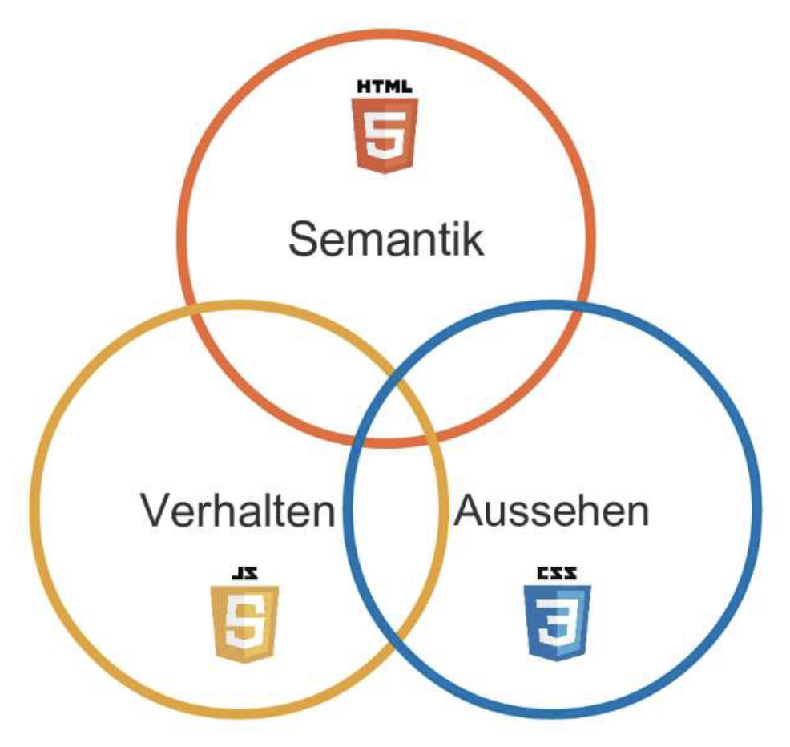
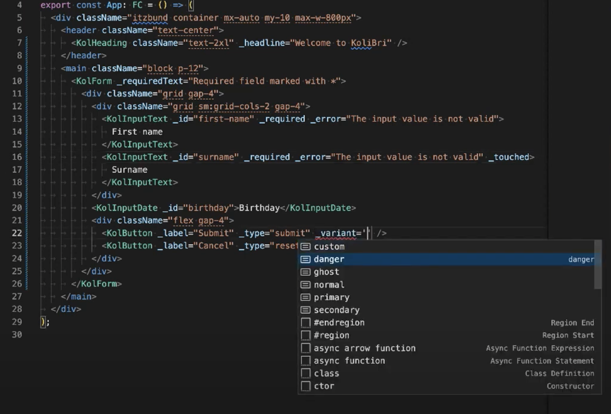

# **Web Components:** The Good Parts

### _The perspective makes the difference_

---
layout: quote
---

# Teaser

Mit Hilfe des **Web Component**-Standard des **W3C** ist es schon seit **2014** möglich **eigene HTML-Elemente** zu erstellen. Aufgrund der **fehlenden** übergreifenden **Browser-Unterstützung** hatten es jedoch die **Web Components** lange Zeit schwer sich durchzusetzen.

Dank **Microsoft** wendet sich **2021** das Blatt und der Web Component-Standard kann endlich zeigen was in ihm steckt. Mit den **Good Part** zeigen wir, wie **leistungsfähig** Web Components sind, wie man sie **richtig verwenden** muss und welche coolen **Features** noch auf uns warten.

Hier im **Meetup** schauen wir hinter die Kulissen und wir loten zusammen aus, wie weit wir mit **Web Components** kommen können.

---
layout: two-cols
---

# Course of content

- Icebreaker
- Speaker introduction
- What is a web component?
  - Semantic, Styling and Behavior
- When do I need web components?
  - motivation: _webstandard vs. framework_
  - qualities: _leading quality characteristics_
  - corporate design: _shadow dom_
  - requirements: _encapsulate anything_

::right::

# <br>

<br>

- **The good parts**
  1. construction: _simple html_
  2. properties: _api design, `_`-prefix, less_
  3. validation: _only string, number, boolean_
  4. consistent styling: _with shadow dom, performance_
  5. handle dynamics: _encapsulate complexity, seo_
  6. pitfalls: _reuse components, event handling, ssr_
  7. developer experience: _typescript power_

---
layout: about-me
---

# Speaker

- Mein Name ist **Martin** Oppitz.
- **Wertegang:**
  - Inzwischen **über 25 Jahre** im Web unterwegs
  - Informatikstudium, Einzelunternehmer und Privatwirtschaft
  - Seit 3 Jahren beim **ITZBund** in der **Architektur-Beratung**
- **Interessen:** Familie, Rad und Ski fahren, Reisen und Open Source

---
layout: two-cols
---

# Web Components
<small class="underline">Was ist eine Web Component?</small>

**Web Components** ist seit Juli 2014 ein **Webstandard** des **<kol-abbr _title="World Wide Web Consortium">W3C</kol-abbr>**.

- Komponente ≙ **eigene** HTML-Elemente
- Komponente besteht aus …
  - HTML <kol-icon _icon="icofont-arrow-right"></kol-icon> **Semantik**
  - JavaScript <kol-icon _icon="icofont-arrow-right"></kol-icon> **Verhalten**
  - CSS <kol-icon _icon="icofont-arrow-right"></kol-icon> **Aussehen**
- **Robuster, konsistenter und teilbarer** Baustein (Shadow DOM)
- **erst 2021** technischer Durchbruch (<kol-abbr _title="Microsoft Internet Explorer 11">IE11</kol-abbr> & <kol-abbr _title="Microsoft Edge Webbrowser">EDGE</kol-abbr>)
- in allen webbasierten Benutzeroberflächen wiederverwendbar

::right::

# <br>

<br>

<div class="block text-center">

</div>


---
layout: two-cols
---

# Motivation
<small class="underline">Wann brauche ich eine Web Component?</small>

**Web Components** eignen sich, um einen möglichst **unabhängigen Standard** zu schaffen.

- Wenn folgende Qualitätsmerkmale Priorität haben:
  - **Kompatibilität** - Webstandard
  - **Portierbarkeit** - Web Components
  - **Robustheit** - Shadow DOM
  - **Wartbarkeit** - Single-Source-Of-Truth
  - **Zugänglichkeit** - Accessibility, BITV
- Konsistenz des Elements durch Shadow DOM
- Kapselung von Anforderungen in Komponente
- Framework-agnostisch durch reine Webstandards

---
layout: two-cols
---

# Button-Task
<small class="underline">In einem Button steckt mehr als nur ein Button?</small>

Folgende **Good Parts** schauen wir uns an:

1. Konstruktion
2. API
3. Validierung
4. Styling
5. Verhalten
6. Fallstricke
7. Developer Experience

---
layout: two-cols
---

# Button-Task
<small class="underline">Die semantische HTML-Konstruktion ist die Basis.</small>

Die **einfachste Konstruktion** ist ein Button mit Text.

```html
<button>Click me</button>
```

Ein Button kann **mehr** beinhalten.

- Text mir Icon
- Nur Icon mit Tooltip
- Rückgabe eines Wertes (z.B. Klick in Liste)
- Verschiedene Varianten (primary, secondary, u.a)
- uvm.

<div class="flex mt-4 gap-2">
  <kol-button data-theme="ecl-eu" _label="Primary" _type="submit" _variant="primary"></kol-button>
  <kol-button data-theme="ecl-eu" _label="Normal mit Icon" _icon="codicon codicon-arrow-up" _variant="normal"></kol-button>
  <kol-button data-theme="ecl-eu" _label="Danger nur Icon" _icon="codicon codicon-trash" _icon-only _variant="danger"></kol-button>
</div>

::right::

# <br>

```html
<my-button ...>
    <button class="primary" type="submit">
        Primary
    </button>
</my-button>

<my-button ...>
    <button class="primary" type="submit">
        <i class="codicon codicon-arrow-left"></i>
        Normal mit Icon
    </button>
</my-button>

<my-button ...>
    <button aria-labelled-by="a665cf" class="danger" type="button">
        <i class="codicon codicon-trash"></i>  
    </button>
    <my-tooltip id="a665cf">Danger nur Icon</my-tooltip>
</my-button>
```

<small class="mt-8 text-xs"><sup>*</sup> Quellcode ist für die bessere Nachvollziehbarkeit stark vereinfacht</small>
---
layout: two-cols
---

# Button-Task
<small class="underline">Konsistenz vs. Flexibilität</small>

**Slot**'s sind definierte Bereiche in einer Web Component, in die beliebiges HTML von außen reingegeben werden kann.

- Gut geeignet für Wrapper-Komponenten
- Ermöglichen Styling von außen (!)
- Bergen Fehlerpotenzial (z.B. falsche Verwendung)
- "Design"-Entscheidung (Konsistenz vs. Flexibilität)

::right::

# <br>

Vor dem Rendern:

```html
<my-button>
  <span class="text-red">Click me</span>
  <svg slot="icon">...</svg>
</my-button>
```

<br>
Nach dem Rendern:

```html
<my-button ...>
    # shadow-root
        <slot name="icon">
            <svg slot="icon">...</svg>
        </slot>
        <slot>
            <span class="text-red">Click me</span>
        </slot>
</my-button>
```


---
layout: two-cols
---

# Button-Task
<small class="underline">API-Design hat was mit Kunst zu tun.</small>

Die **API** einer Komponente stellen die selbst definierten Attribute dar, um verschiedene Ausprägungen zu ermöglichen.

```html
<my-button _label="Primary" _variant="primary"></my-button>
```

Das **API**-Design hat großen **Einfluss** auf die **Langlebigkeit**.

- Nur soviel wie nötig und so wenig wie möglich!
- _Underline_ Attribut-Name mit einem `_` (z.B. `_label`)
- HTML kennt nur die Attribut-Typen: `string`, `boolean`, `number`


::right::

# <br>

```html
<my-button
  _label="Primary"
  _variant="primary">
</my-button>

<my-button
  _icon="codicon codicon-arrow-left"
  _label="Normal mit Icon"
  _variant="normal">
</my-button>

<my-button
  _icon="codicon codicon-arrow-left"
  _hide-label
  _label="Danger nur Icon"
  _variant="danger">
</my-button>
```

---
layout: two-cols
---

# Button-Task
<small class="underline">Denke stets aus Sicht von Web Components.</small>

Web Components sind die einfachst Form von **Komponenten** und verstehen nicht _ohne Weiteres_ komplexen Attribut-Werte.

- Trenne äußere Attribut-Werte von inneren State-Werten
- Validiere und mappe Attribut- auf State-Werte
- Schützt vor unerwarteten Verhalten (z.B. Exceptions)
- Sorgfalt bei reflektierten Attributen (reflect)
- Listen und statische Objekte sind möglich

::right::

# <br>

```ts
function validateButtonVariant(value?: ButtonVariant): boolean {
    return value === 'primary' || value === 'secondary' || value === 'normal' ||
    value === 'danger' || value === 'ghost' || value === 'custom';
}

class Button {
    @Prop()
    public _variant?: ButtonVariant;

    @State()
    private state: ButtonState = {
        variant: 'normal',
    };

    @Watch('_variant')
    private mapButtonVariant(value?: ButtonVariant): void {
        if(validateButtonVariant(value)) {
            this.state.variant = value;
        }
    }
}
```

---
layout: two-cols
---

# Button-Task
<small class="underline">Konsistentes Corporate Design</small>

Web Components ermöglichen das unabhängige<sup>*</sup> Styling innerhalb der Komponente.

- **Shadow DOM** muss aktiviert sein
- Styling ist vor äußeren Styles **geschützt**
- `<style>` Tags vermeiden
- **CSS-Properties** nutzen (Design-Tokens)
- `::part` ermöglicht kontrolliertes Stylen

<small class="mt-8 text-xs"><sup>*</sup> Es gibt Möglichkeiten das Standard-Verhalten zu umgehen.</small>

<div class="grid mt-4 gap-2">
  <div class="flex gap-2">
    <kol-button data-theme="ecl-eu" _label="Primary" _variant="primary"></kol-button>
    <kol-button data-theme="ecl-eu" _label="Normal mit Icon" _icon="codicon codicon-arrow-up" _variant="normal"></kol-button>
    <kol-button data-theme="ecl-eu" _label="Primary" _icon="codicon codicon-trash" _icon-only _variant="danger"></kol-button>
    <button>Click me</button>
  </div>
</div>

::right::

# <br>

```css
div.styling {
	  border: 1px dashed grey;
    padding: 0.25em;
}
div.styling button {
    background-color: rgb(235, 57, 188);
    border: 3px solid rgb(105, 5, 77);
    border-radius: 0.5em;
    color: rgb(19, 215, 74);
    font-family: monospace;
    font-weight: 700;
    padding: 0.5em;
    transform: scale(-1, 1);
}

```

<div class="grid mt-4 gap-2">
  <div class="styling flex gap-2">
    <kol-button data-theme="ecl-eu" _label="Primary" _variant="primary"></kol-button>
    <kol-button data-theme="ecl-eu" _label="Normal mit Icon" _icon="codicon codicon-arrow-up" _variant="normal"></kol-button>
    <kol-button data-theme="ecl-eu" _label="Primary" _icon="codicon codicon-trash" _icon-only _variant="danger"></kol-button>
    <button>Click me</button>
  </div>
</div>

---
layout: two-cols
---

# Button-Task
<small class="underline">Das Rad nicht neu erfinden.</small>

Komplexe Themen sollten möglichst nur einmal gelöst werden (Single-Source-Of-Truth).

- Richtige Darstellung in unterschiedlichen Varianten
- Richtige Semantik bei unterschiedlichen Ausprägungen
- Richtiges Verhalten bei unterschiedlichen Interaktionen
- Beispiele:
  - Tooltip, Esc, Mouseover, Focus
  - Aria-Auszeichnung

::right::

# <br>

<div class="grid mt-4 gap-2">
  <kol-input-text data-theme="bmf" _error="Bitte geben Sie einen Wert ein.">Vorname (Style 1)</kol-input-text>
  <kol-input-text data-theme="mapz" _error="Bitte geben Sie einen Wert ein.">Vorname (Style 2)</kol-input-text>
  <kol-input-text data-theme="ecl-ec" _error="Bitte geben Sie einen Wert ein.">Vorname (Style 3)</kol-input-text>
  <div class="flex gap-2">
    <kol-button data-theme="ecl-eu" _label="Normal mit Icon" _icon="codicon codicon-arrow-up" _variant="normal"></kol-button>
    <kol-button data-theme="ecl-eu" _label="Primary" _icon="codicon codicon-trash" _icon-only _tooltip-align="bottom" _variant="danger"></kol-button>
  </div>
</div>

---
layout: two-cols
---

# Button-Task
<small class="underline">Fallstricke einfach lösen.</small>

Manche Vorteile von Web Components sind nachteilig. Doch diese lassen sich größtenteils lösen.

- Wiederverwendung von Komponenten (shadow & non-shadow)
  - Browser- und Tool-Unterstützung (Test, Extensions)
- Slot's bedacht verwenden (Standardisierungsgedanke)
- Event-Handling (<kol-link _label="Form-associated custom elements" _href="https://web.dev/more-capable-form-controls/" _target="wev.dev"></kol-link>)
- Server-Side-Rendering (<kol-link _label="Declarative Shadow DOM" _href="https://web.dev/declarative-shadow-dom/" _target="wev.dev"></kol-link>)

::right::

# <br>

```html
<kol-button data-theme="ecl-eu" _icon-only="" style="" class="hydrated">
    <!-- shadow-root -->
    <kol-button-wc class="button danger" _icon-only>
        <button aria-labelledby="23f261" class="danger icon-only" type="button">
            <kol-span-wc class="icon-only" _icon-only>
                <span>
                    <kol-icon class="icon left"></kol-icon>
                </span>
            </kol-span-wc>
        </button>
        <kol-tooltip aria-hidden="true">
            <div id="floating" style="display: none; left: 38.4453px; top: 208.391px; visibility: hidden;">
                <div id="arrow" style="left: 30.5px; bottom: -5px;"></div>
                <kol-badge id="23f261"></kol-badge>
            </div>
        </kol-tooltip>
    </kol-button-wc>
</kol-button>
````


---
layout: two-cols
---

# Button-Task
<small class="underline">Volle Meta-Power bis in Development.</small>

Die Entwickelnden erhalten alle Meta- und Typ-Informationen<sup>*</sup> aus dem Code der Web Components in Ihren IDEs.

- generiert JSDoc und Typ-Definitionen
  - Spezifikation (md, json)
  - TypeScript-Definition (d.ts, json)
  - HTML-Definition (json)
- Framework-Adapter
  - Angular, React und Vue
  - Vaadin (Draft)
  - HTML

<small class="mt-8 text-xs"><sup>*</sup> Ist abhängig von der Individualität der Frameworks und der IDE-Unterstützung.</small>

::right::

# <br>

<br>

<div class="block text-center">

</div>
